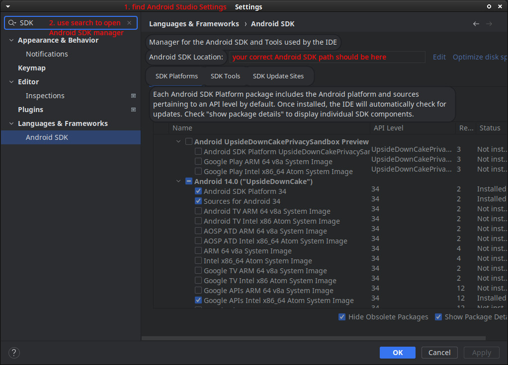
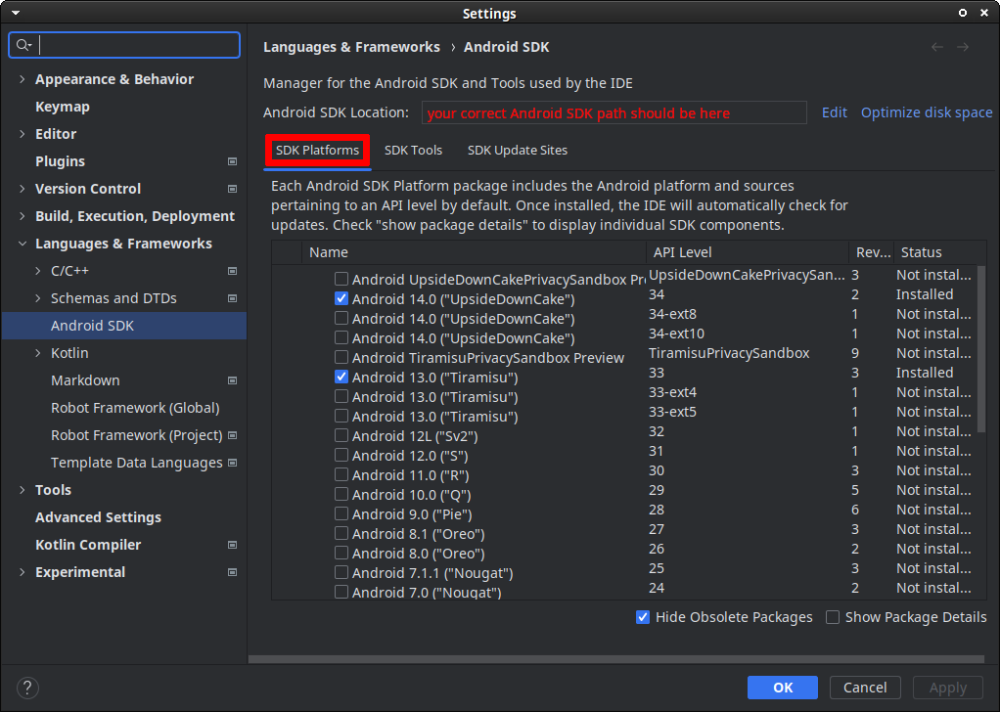
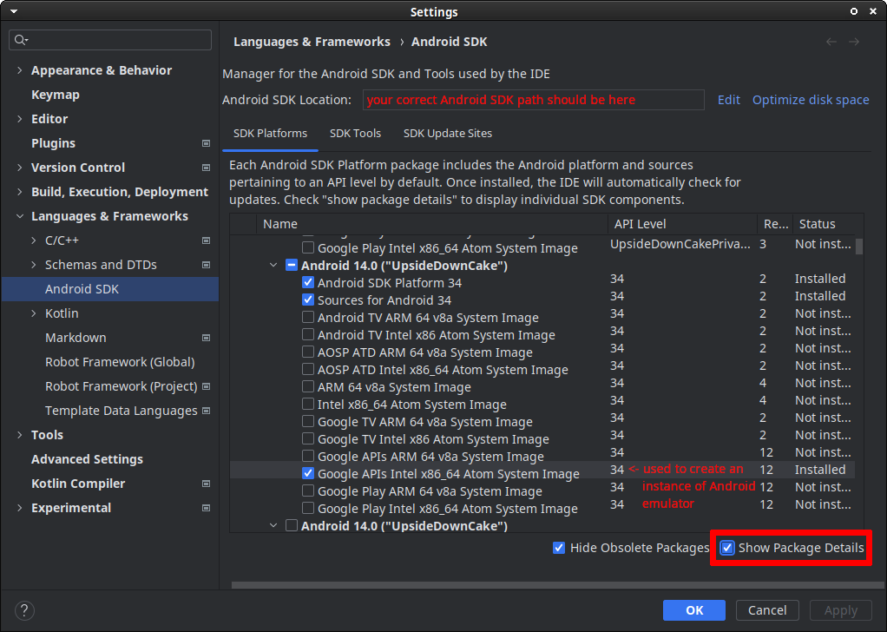
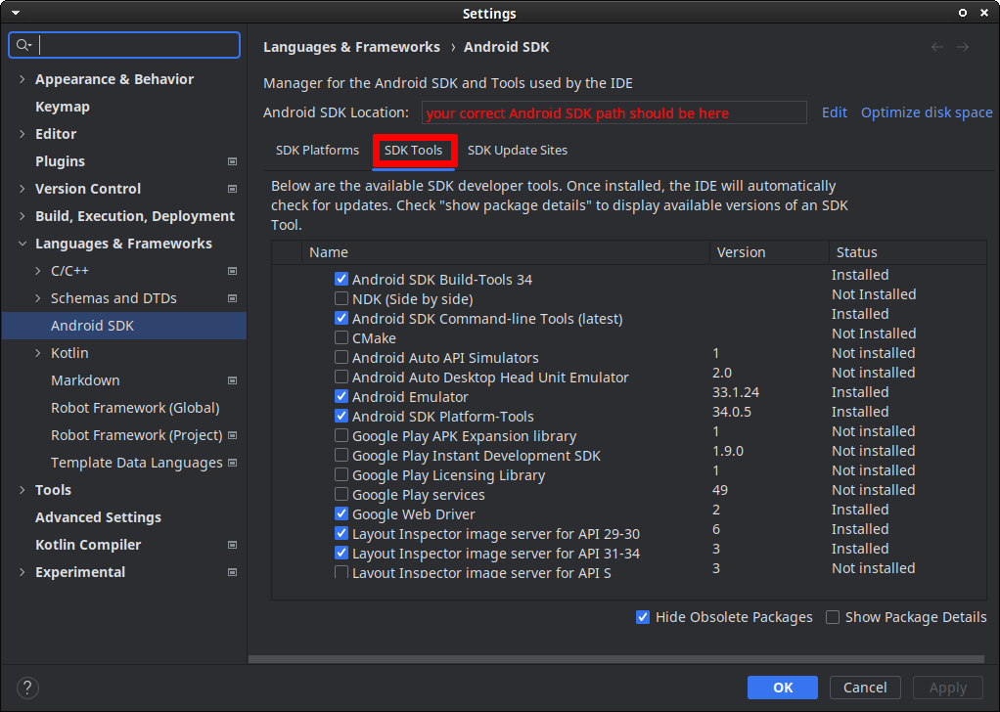

# How to test mobile apps with Robot Framework and Appium

## Introduction

This repo contains instructions for a workshop on mobile application testing with Robot Framework and Appium. All participants are required to have a ready development environment before joining the workshop. Instructions for that are below. Note that this setup is a task that can take some time. Required elements like connecting to test devices is often error-prone. Please start well in advance.

If you have trouble with the instructions, or would like to approach the topic differently, please contact the instructors.

## Table of contents
<!-- TOC -->
* [How to test mobile apps with Robot Framework and Appium](#how-to-test-mobile-apps-with-robot-framework-and-appium)
  * [Introduction](#introduction)
  * [Table of contents](#table-of-contents)
* [Instructions for setup with virtual environments](#instructions-for-setup-with-virtual-environments)
  * [Step 0. Download Android SDK and its tools](#step-0-download-android-sdk-and-its-tools)
  * [Step 1. Get Appium Doctor to work (in virtual environments)](#step-1-get-appium-doctor-to-work-in-virtual-environments)
    * [Create a python virtual environment](#create-a-python-virtual-environment)
    * [Create a nodeJS virtual environment](#create-a-nodejs-virtual-environment)
  * [Step 2. Set up everything else for Android](#step-2-set-up-everything-else-for-android)
    * [Java](#java)
    * [bundletool jar](#bundletool-jar)
    * [ffmpeg](#ffmpeg)
    * [GStreamer tools](#gstreamer-tools)
  * [Step 3. Android setup summary and environment check](#step-3-android-setup-summary-and-environment-check)
  * [Step 4. Testing with physical Android phones](#step-4-testing-with-physical-android-phones)
  * [Step 5. Software for UI inspections](#step-5-software-for-ui-inspections)
  * [Step 6. Setup for iOS development (macOS only)](#step-6-setup-for-ios-development-macos-only)
* [Final notes](#final-notes)
<!-- TOC -->

# Instructions for setup with virtual environments
We recommend setting up using virtual environments, and the following instructions focus on this.
Setup may be easier to do with macOS or Linux, however we had some problems with Windows. For some of them, we wrote [additional instructions](./further-reading.md).  Please contact us if you have encountered any issues you couldn't solve.

In the instructions we will make changes to the `${PATH}` variable.  Keep track of what you do to it!
You can use this information later to create a script that enables the full environment instantly.

## Step 0. Download Android SDK and its tools
Make sure that you have a new Android Studio with Android SDK downloaded, and installed. Note that it is not enough to download the zip files, you also need to unpack them and use the SDK Manager to download binary tools as well as system image(s). That may require about 6-10GB of space.

Visit https://developer.android.com/studio and download a copy of Android Studio Ladybug. If you already have a copy, but it is older than a 2024 release, please get newer one.

<details><summary>
Open this section to follow the screenshots and see what you need to download in Android Studio.</summary>

Please note that provided screenshots were made in January 2024, with Android Studio Hedgehog release. There may be minor discrepancies between them and the newest IDE. Use your own discretion to navigate the changes. You are free to download a more recent API version like 35.






</details>

Downloading Android Studio (or Android SDK) also requires setting variable `${ANDROID_HOME}`. If you used Android Studio to set up Android SDK for you, take the path that the SDK Manager is listing in the field marked by red text in the screenshots.

To check the variable is not empty run:
```bash
echo ${ANDROID_HOME}
```

Based on that `${ANDROID_HOME}` variable, you will have to modify the `${PATH}`:
```bash
export PATH=${PATH}:${ANDROID_HOME}/cmdline-tools/latest/bin:${ANDROID_HOME}/emulator:${ANDROID_HOME}/platform-tools
```
These three paths are necessary for easy access to the tools.
Note that the folder structure of an older Android SDK may be different. If your SDK is old, and has been updated, it may contain folder `tools` instead of `cmdline-tools`. You should add it to the `${PATH}` in the same manner.

## Step 1. Get Appium Doctor to work (in virtual environments)
You need to be able to execute Robot Framework, Appium, and Appium Doctor from the command line. Ideally from virtual environments, not system-wide.

For that you will need to have in your system Python 3 with pip, wheel, virtualenv (not venv), as well as Node.js with npm.

Check what you have with the following commands:
```bash
python3 --version
python3 -m pip --version
python3 -m pip show virtualenv
python3 -m pip show wheel
node --version
npm --version
```
You need python _>=3.8_ and node _>=16.13.0_. Note that stable newest release is best to use. If you have something older and aren't sure if it's OK, please upgrade.
If you are missing these tools, please use the official instructions on how to install them on your operating system. Ubuntu users may have a new tool `pipx` available, but as we have no experience with it, we cannot recommend it.

- https://www.python.org/
- https://pypi.org/project/wheel/
- https://virtualenv.pypa.io/en/latest/installation.html
- https://nodejs.org/en/download

### Create a python virtual environment
Create environment with your preferred name (in the example it's `python-env`). Activate it. Check that pip in use is that of the virtual environment.
```bash
python3 -m virtualenv python-env
source python-env/bin/activate
which pip
pip install -r requirements.txt
```
Install the necessary Robot packages from requirements.txt, along with `nodeenv` we will use to create a virtual environment for Node.js.

_Do not deactivate the python virtual environment!_

### Create a nodeJS virtual environment
In the same terminal, create a Node.js environment with your preferred name (in the example it's `node-env`). Activate it, and check that npm in use is that of the virtual environment.
```bash
nodeenv node-env
source node-env/bin/activate
which npm
```
Install the necessary Node.js packages. Go for latest stable Appium (in February 2025 it is 2.15.0). Check with `which` that Appium is indeed installed in the virtual environment, not system-wide.
```bash
npm install -g appium
npm install -g mjpeg-consumer
which appium
```
At this point you should have two virtual environments enabled at the same time. _Keep them both active!_

Alternatives to `nodeenv` (like prefix) are in [Further reading](./further-reading.md) document, if you cannot get it to work for you.

## Step 2. Set up everything else for Android
You should be able to run Appium Doctor now! It is a tool that checks driver-specific setup, so you need drivers first, and then you can verify your setup is complete.

Note that Appium installs the drivers in the `${APPIUM_HOME}` directory. If this variable is not set, then Appium will install drivers a hidden directory inside the user's `${HOME}`. You can only have one driver version installed in `${APPIUM_HOME}`. We recommend you create a driver-specific directory and set `${APPIUM_HOME}` variable before installing uiautomator2. To have everything together, you could create it inside the same folder in the same location as the `python-env` and `node-env` directories.

Start with installing UiAutomator2 driver. Then execute Appium Doctor with for this driver. The output of this command will `WARN` you if you are still missing something.
```bash
export APPIUM_HOME=/your/absolute/path/to/directory/for/appiumdrivers
appium driver install uiautomator2
appium driver doctor uiautomator2
```
Read Appium Doctor's output. Below we list some of the issues you may have to resolve in your system, and how to do it neatly.

### Java
Install Java. For work with newer Androids, latest stable Java 21 or 17 should be good enough. Make sure that Java is in the `${PATH}` and the `${JAVA_HOME}` is set correctly. Use the recommended installer for your OS.

Alternatively, you can download Adoptium's Temurin Java from https://adoptium.net/marketplace/?os=any&version=17 and unzip it somewhere. Then you need to use that location as your new `${JAVA_HOME}`. This way you can set up and switch between different Java versions.

Here are commands how the variables should look:
```bash
export JAVA_HOME=/your-java-absolute-path
echo ${JAVA_HOME}
export PATH=${JAVA_HOME}/bin:${PATH}
java -version
```

If you have more than one Java version installed, to avoid random errors, please keep using the same Java version with all Android SDK commands.

### bundletool jar
Download the latest bundletool from https://github.com/google/bundletool/releases/ (in February 2025 it should be _1.18.0_). You will need to add it to the `${PATH}` for Appium.
Note that Appium looks for `bundletool.jar`, while the distributed `.jar` file has a version number.

You can rename the file, or keep the original (so you can still see the version), but create a soft-link to it. You also need to make it executable.
```bash
ln -s bundletool-all-1.18.0.jar bundletool.jar
chmod ug+x bundletool-all-1.18.0.jar
```

### ffmpeg
This is a necessary system-wide installation. Use official instructions from https://ffmpeg.org/download.html

### GStreamer tools
This is a necessary system-wide installation. Use the instructions linked by Appium Doctor.

## Step 3. Android setup summary and environment check
When you are done with the last step, you should have two virtual environments enabled (changing your `${PATH}`), and manually-added directories in your `${PATH}` variable:
- absolute path to python environment with Robot Framework and AppiumLibrary
- absolute path to nodejs environment with Appium
- absolute path to Java's JDK and JRE binaries
- absolute path to a folder containing `bundletool.jar` or a link to it
- Android Home's subdirectory `cmdline-tools/latest/bin`
- Android Home's subdirectory `emulator`
- Android Home's subdirectory `platform-tools`

Re-run Appium Doctor. Check that there are no WARN messages anymore in the output.
```bash
appium driver doctor uiautomator2
```
## Step 4. Testing with physical Android phones
We instruct you to download an emulator image, and we will test mostly with them. However, you can (and should try to) run tests on actual Android phones.

On macOS, no additional setup should be needed.

On Windows, you may have to install drivers according to documentation https://developer.android.com/studio/run/oem-usb

On Linux, connecting an Android smartphone does not make it immediately usable for Android SDK. You need to add udev rules. Use the udev rules from this repository:
https://github.com/M0Rf30/android-udev-rules
and make sure your user is part of the `plugdev` and `adbusers` groups.

## Step 5. Software for UI inspections
Get an executable of the newest version of Appium Inspector from https://github.com/appium/appium-inspector/releases

## Step 6. Setup for iOS development (macOS only)
These instructions assume you have done all the steps for the Android side. We will re-use the virtual environments.

Make sure you have both python and nodeenv virtual environments activated. Use the following command to install and run the iOS driver for Appium:
```bash
appium driver install xcuitest
appium driver doctor xcuitest
```
Read the output of Appium Doctor for `xcuitest` driver. Follow the instructions to set up Xcode.

You will have to download Apple's Xcode, and might need to set up a developer account to achieve that.

Check that you can use an iOS simulator. Run the following command:
```bash
xcrun simctl
```
If the command is ok, it should print command's help text for you. If something is wrong, it should print an error.

# Final notes
Please keep using output of the `appium driver doctor <driver>` commands to verify your environment. If the output is clean, and your python environment is ok, you should be good to go.

We recommend you create your own way to swiftly enable both virtual environments, one after another. This will be useful for both Android and iOS. For Android, you will need also changes to `${PATH}` (summarised in Step 3.).

If you would like to get further clarifications, you can refer to the [Further reading](./further-reading.md) document.
